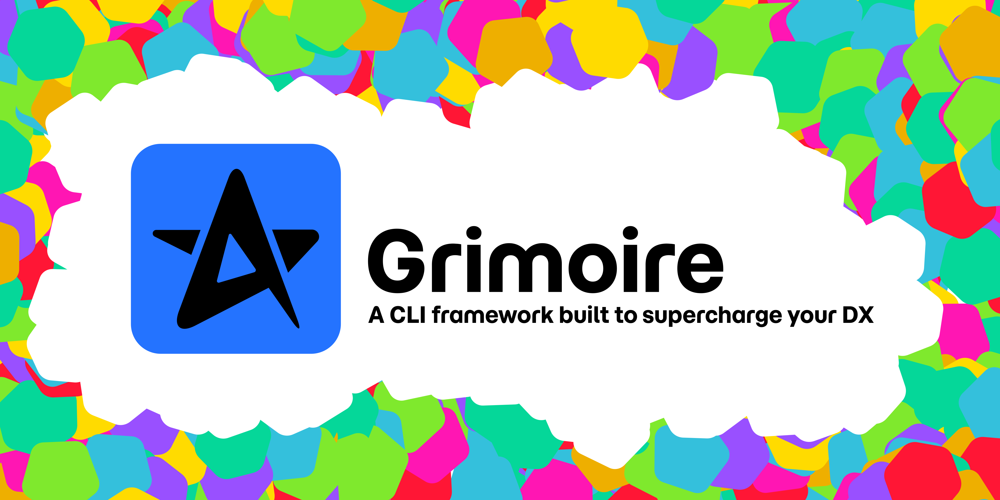

> 🚧 **Coming Soon**  
> This repository is a preview of **Grimoire**, a CLI framework to boost developer experience.  
> The first public release is on its way — contributions and feedback are welcome in the meantime!

# Grimoire

**Grimoire** is a CLI framework designed to improve developer experience across tooling, testing, and code generation.

It helps teams build better CLIs, streamline workflows, and scaffold consistent developer tools — with metadata generation as a bonus.

---

## What is Grimoire?

Grimoire is a modular CLI framework built for DX-first development.

It provides:

- 🧱 A foundation for building custom CLIs
- ⚙️ Utilities to scaffold, test, and document CLI tools
- 📦 Optional metadata generation in `.gen.{json,yaml,md...}` formats

> Whether you're building internal tools or public-facing CLIs, Grimoire helps you do it faster and cleaner.

---

## Core Packages

| Package                        | Description                                                                 |
|-------------------------------|-----------------------------------------------------------------------------|
| `@arckate/grimoire-core`      | The engine — provides CLI structure and optional metadata generation        |
| `@arckate/grimoire-cli`       | The CLI — scaffolds CLI tools and improves DX   
| `@arckate/grimoire-tome`      | A bundle of generators/starters for React, .NET, Java, and more                                              |
| `@arckate/testing-cli`        | A testing utility inspired by Testing Library, built on Commander            |
| `@arckate/handlebars-ml`      | VSCode/JetBrains plugin to highlight `.hbs.*` and `.handlebars.*` files      |

---

## Use cases

- Build consistent CLI tools for your team or product
- Scaffold generators and starters for multiple stacks
- Simplify CLI testing with expressive utilities
- Highlight templating files in your IDE
- Optionally generate metadata for documentation or automation